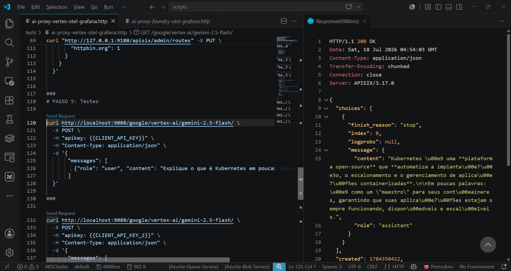
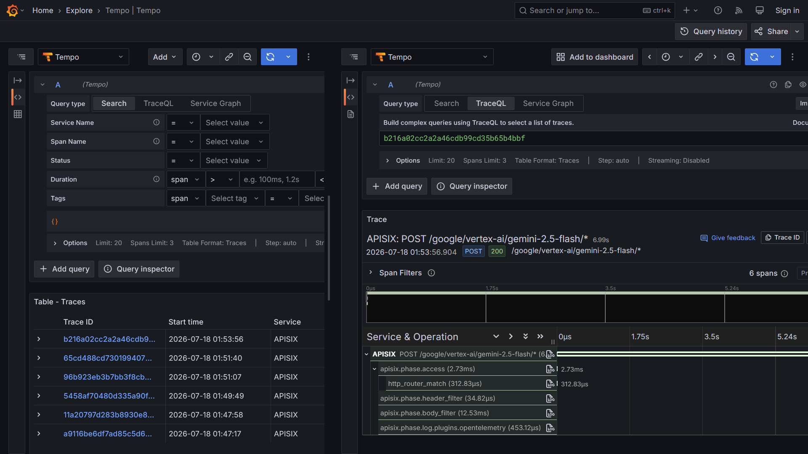
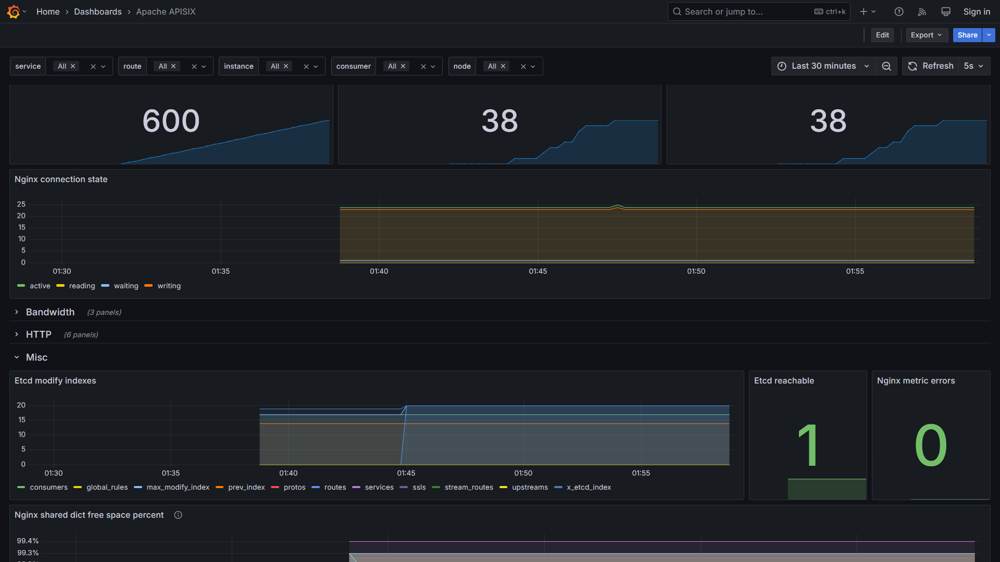

# apisix-ai-gateway-vertex-otel-grafana-prometheus-dockercompose

Scripts do Docker Compose para subida de um ambiente do APISIX com capacidade de AI Gateway. Inclui monitoramento com Grafana + OpenTelemetry + Prometheus, com geração de traces de requisições direcionadas ao APISIX e coleta de métricas. IA testada: Vertex AI/Gemini Enterprise Agent Platform.

Testes realizados no Visual Studio Code:

Trace no Grafana Tempo:

Dashboard Grafana para APISIX: **https://grafana.com/grafana/dashboards/11719-apache-apisix/**

Monitorando a instância do APISIX via dashboard Grafana:

